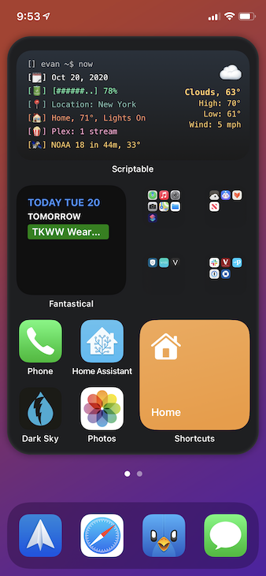
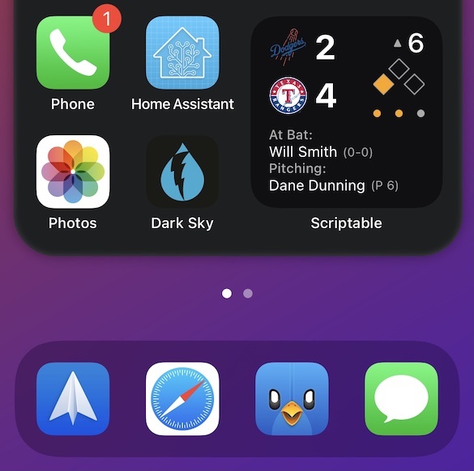
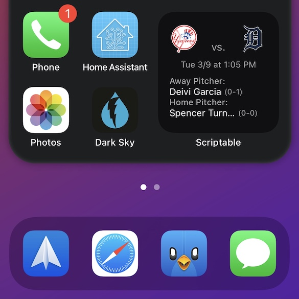

# scriptable

A collection of my scriptable.app scripts

## Scripts

### Modified TermiWidget

Original by @spencerwooo: https://gist.github.com/spencerwooo/7955aefc4ffa5bc8ae7c83d85d05e7a4

Copy both src/TermiWidget.js and src/cache.js into your Scriptable iCloud Drive folder and modify the values at the top of TermiWidget.js

### MLB Scores

Copy dist/MLB.js into your Scriptable iCloud Drive folder (or copy & paste into a new script in the Scriptable app).

## Images

TermiWidget            |  MLB
:-------------------------:|:-------------------------:
 |  

